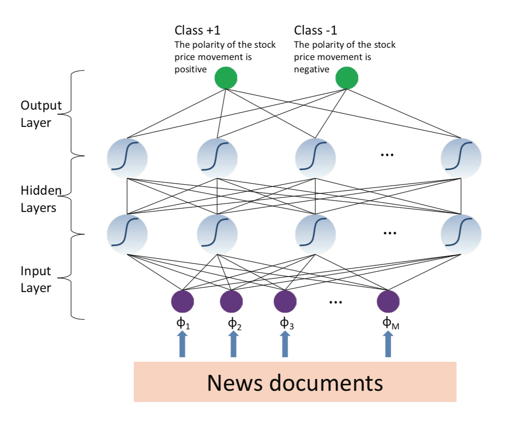

# StockPredict

### Motivation
Based on the news articles crawled from Bloomberg and Reuters in time span of 2006.10-2013.11, and S&P 500 Daily Stock Price data, we try to predict the rise and fall of stock price based on the news of the previous day.

There are in total 448315 new articles in 1041 days. The stock prices data include the prices of S&P 500 and the Index from Yahoo Finance.

### Model Description
Features: Bag of words TFIDF features, Event features extracted from OpenIE.
Models: SVM, Feedforward Neural Network.

### Results

Predict the stock price rise and fall of Google:

|       | Baseline (Majority vote) | SVM + BoW | SVM + Event | NN + BoW | NN + Event |
| ----- | ------------------------ | --------- | ----------- | -------- | ---------- |
| Train | 52.05%                   | 99.73%    | 80.27%      | 52.05%   | 63.29%     |
| Dev   | 58.91%                   | 50.39%    | 58.91%      | 58.91%   | 52.71%     |
| Test  | 50.69%                   | 50.00%    | 47.92%      | 49.31%   | 50.00%     |

It is a little disappointed that our model does not beat the baseline. The reason may be that the algorithm to classify the news by company is not good enough, the features are too sparse, etc...

### References

[1] Ding, X., Zhang, Y., Liu, T., & Duan, J. (2014). Using structured events to predict stock price movement: An empirical investigation. In Proceedings of the 2014 Conference on Empirical Methods in Natural Language Processing (EMNLP) (pp. 1415-1425).

[2] Ding, X., Zhang, Y., Liu, T., & Duan, J. (2015, July). Deep learning for event-driven stock prediction. In Ijcai (pp. 2327-2333).
